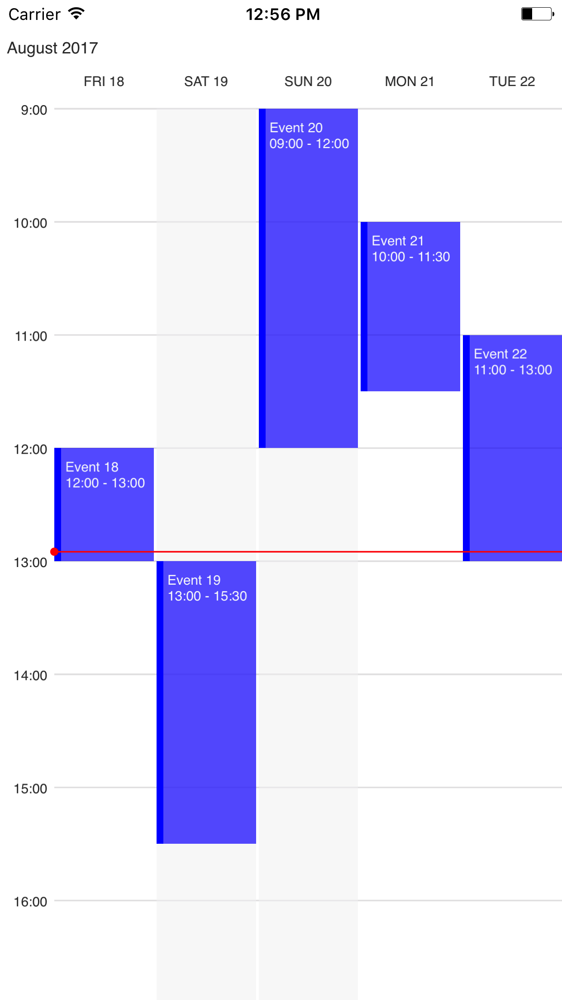

# Swift-Week-View
An iOS calendar library for displaying calendar events in a week view.

<p align="center">
	
	
</p> 

## Features
- See calendar events in a week view
- Asynchronously load calendar events
- Show a line at the current time
- Infinite horizontal scrolling
- Snaps to closest day after scrolling
- Interface builder preview

## Usage
### 1. Download [source](https://github.com/EvanCooper9/swift-week-view/tree/master/Source) files and install [dependencies](https://github.com/EvanCooper9/swift-week-view#dependencies)

### 2. Implement the WeekViewDataSource Protocol
Implement the `generateEvents` protocol function. This function should return a list of `WeekViewEvent`s specific to the day of `date`. See [here](malcommac.github.io/SwiftDate/manipulate_dates.html#dateatunit) for SwiftDate documentation on creating date objects at specific times. Currently, events rely on a [24-hour clock](https://en.wikipedia.org/wiki/24-hour_clock).

```Swift
func generateEvents(date: DateInRegion, completion: (([WeekViewEvent]) -> Void)?) -> [WeekViewEvent] {
    // create a WeekViewEvent for the day of date
    let start = date.atTime(hour: 12, minute: 0, second: 0)!
    let end = date.atTime(hour: 13, minute: 0, second: 0)!
    let event: WeekViewEvent = WeekViewEvent(title: "Lunch", startDate: start, endDate: end)
    return [event]
}
```
#### Available arguments for `WeekViewEvent`
- `title`: the title of the event
- `startDate`: the start of the event
- `endDate`: the end of the event
- `color`: (Optional) the color that the event will be displayed in. Defaults to red.

> #### Note:
> - Events are added to the view asynchronously by default. This means you can make blocking calls in the generateEvents function, and the events will still play nicely with everything else.
> - The optional completion handler is currently `nil`, but in future will provide funcitonality to make non-blocking calls to fetch data for events, since some API calls by nature are non-blocking and don't have the ability to be synchronous. 

### 3. Initialize the instance
#### A. Programmatically
Create an instance of `WeekView`, specify it's delegate, and add it as a subview

```Swift
let weekView: WeekView = WeekView(frame: frame, visibleDays: 5, startHour: 9, endHour: 17)
weekView.dataSource = self
self.view.addSubview(weekView)
```
##### Available arguments for `WeekView`
- `frame`: the frame of the calendar view
- `visibleDays`: an instance of a ViewCreator subclass that overrides the createViewSet method.
- `date`: (Optional) the day `WeekView` will initially load. Defaults to the current day.
- `startHour`: (Optional) the earliest hour that will be displayed. Defaults to 09:00.
- `endHour`: (Optional) the latest hour that will be displayed. Defalts to 17:00.
- `colorTheme`: (Optional) the colors used in the view. Defaults to `LightTheme`.

#### B. Storyboard
Add a view to the storyboard and make it's class `WeekView`. Then connect the view as an outlet to your view contoller and set the data source.
```Swift
@IBOutlet weak var weekView: WeekView!
weekView.dataSource = self
```

## Dependencies
### [SwiftDate](https://github.com/malcommac/SwiftDate), via [Cocoapods](https://cocoapods.org)
```ruby
pod 'SwiftDate', '~> 4.0'
```

## Example
See the included example for basic implementation. Make sure to download the *entire* repository, and then open the `.xcworkspace` for it to work properly with the Source files and CocoaPods.

## Up Next
- Add events with touch gestures
- Ability to scroll vertically through the full hours of the day.