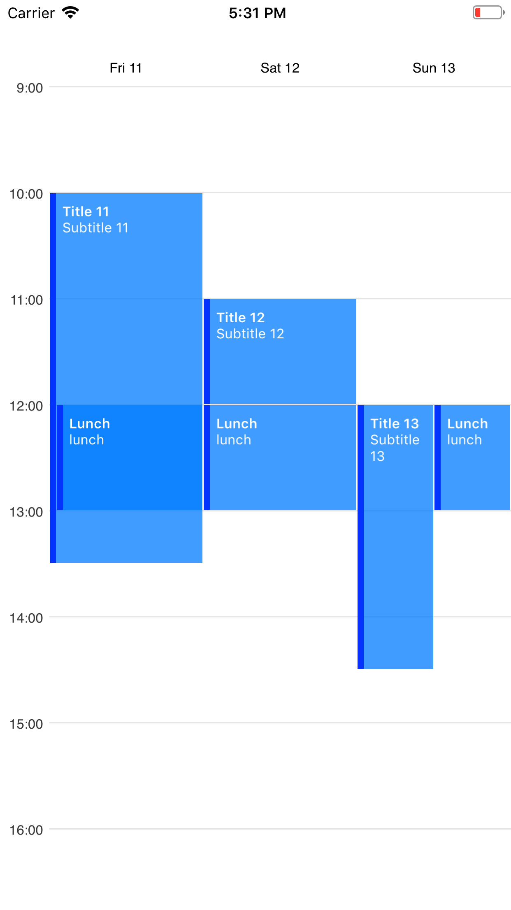
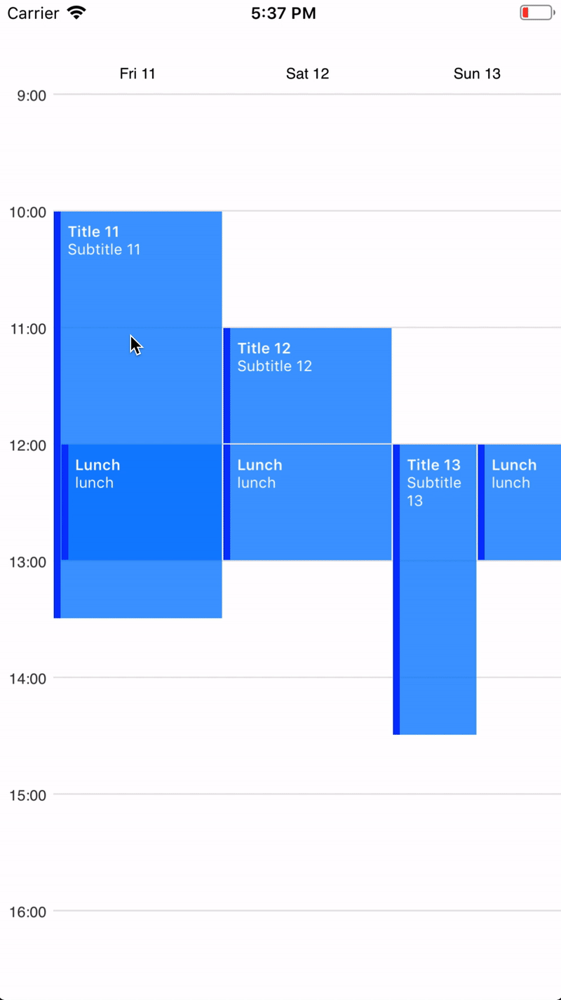

# Swift-Week-View
An iOS calendar library for displaying calendar events in a week view.

<p align="center">
    
    
    
</p>

## Features
- See calendar events in a week view
- Asynchronously load calendar events
- Interaction with specific events by clicking
- Interaction with free time spaces by clicking
- Custom styling
- Infinite horizontal scrolling

## What's New?
- Using [TimelineCollectionView](https://github.com/EvanCooper9/TimelineCollectionView) as a foundation over a custom UIScrollView for improved stability
- Improved display of events that overlap
- Improved handling of asynchronously-fetched data
- Bug fixes

## Installation
Download [`Source`](https://github.com/EvanCooper9/swift-week-view/tree/master/Source) files and install [dependencies](https://github.com/EvanCooper9/swift-week-view#dependencies)

## Usage
### 1. Implement the WeekViewDataSource Protocol
Implement the `weekViewGenerateEvents` protocol function. This function should return a list of `WeekViewEvent`s specific to the day of `date`. Events that can be created immediately should be returned to this function. Events that require time to create should be passed to `eventCompletion`, which will overwrite previously returned events. See [here](malcommac.github.io/SwiftDate/manipulate_dates.html#dateatunit) for SwiftDate documentation on creating date objects at specific times. Currently, events rely on a [24-hour clock](https://en.wikipedia.org/wiki/24-hour_clock).

```Swift
func weekViewGenerateEvents(_ weekView: WeekView, date: DateInRegion, eventCompletion: @escaping ([WeekViewEvent]?) -> Void) -> [WeekViewEvent]? {
  let start: DateInRegion = date.dateBySet(hour: 12, min: 0, secs: 0)!
  let end: DateInRegion = date.dateBySet(hour: 13, min: 0, secs: 0)!
  let event: WeekViewEvent = WeekViewEvent(title: "Lunch", start: start, end: end)

  DispatchQueue.global(.background).async {
    // do some async work & create events...
    eventCompletion([event, ...])
  }

  return [event]
}
```
#### Available arguments for `WeekViewEvent`
- `title`: the title of the event
- `subtitle`: a subtitle or description of the event
- `start`: the start time of the event
- `end`: the end time of the event

### 2. Initialize the instance
#### 2A. Programmatically
Create an instance of `WeekView`, specify it's data source, and add it as a subview.

```Swift
let weekView = WeekView(frame: frame, visibleDays: 5)
weekView.dataSource = self
addSubview(weekView)
```
##### Available arguments for `WeekView`
- `frame`: the frame of the calendar view
- `visibleDays`: amount of days that are visible on one page. Default = 5
- `date`: (Optional) the day `WeekView` will initially load. Default = today

#### 2B. Storyboard
Add a view to the storyboard and set it's class `WeekView`. Assign the view's data source programmatically.
```Swift
@IBOutlet weak var weekView: WeekView!
weekView.dataSource = self
```

## User Interaction
To handle interaction with `WeekView`, implement the `WeekViewDelegate` protocol and set the `delegate` property to the implementing class.

```Swift
// Fires when a calendar event is touched on
func weekViewDidClickOnEvent(_ weekView: WeekView, event: WeekViewEvent, view: UIView)

// Fires when a space without an event is tapped
func weekViewDidClickOnFreeTime(_ weekView: WeekView, date: DateInRegion)
```

## Custom Styling
To use custom styling, implement the `WeekViewStyler` protocol and assign the `styler` property to the implementing class. `WeekView` by default is its own styler.

```Swift
// Creates the view for an event
func weekViewStylerEventView(_ weekView: WeekView, eventContainer: CGRect, event: WeekViewEvent) -> UIView

// Create the header view for the day in the calendar. This would normally contain information about the date
func weekViewStylerHeaderView(_ weekView: WeekView, with date: DateInRegion, in cell: UICollectionViewCell) -> UIView
```

## Dependencies
### [TimelineCollectionView](https://github.com/EvanCooper9/TimelineCollectionView)
Included in [`Source`](https://github.com/EvanCooper9/swift-week-view/tree/master/Source) as a framework. Make sure to add `TimelineCollectionView.framework` to your target's `Embedded binaries`.

### [SwiftDate](https://github.com/malcommac/SwiftDate), via [Cocoapods](https://cocoapods.org)
Currently, SwiftDate versions 5.0.x are supported
```ruby
pod 'SwiftDate', '~> 5.0'
```

## Example
See the included example for basic implementation. Make sure to download the *entire* repository, and then open the `.xcworkspace` for it to work properly with the Source files and CocoaPods.
